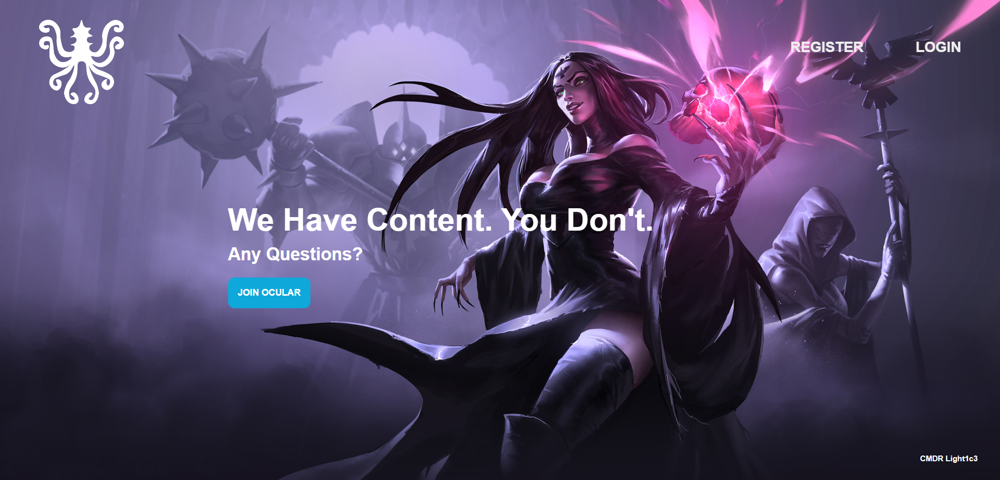
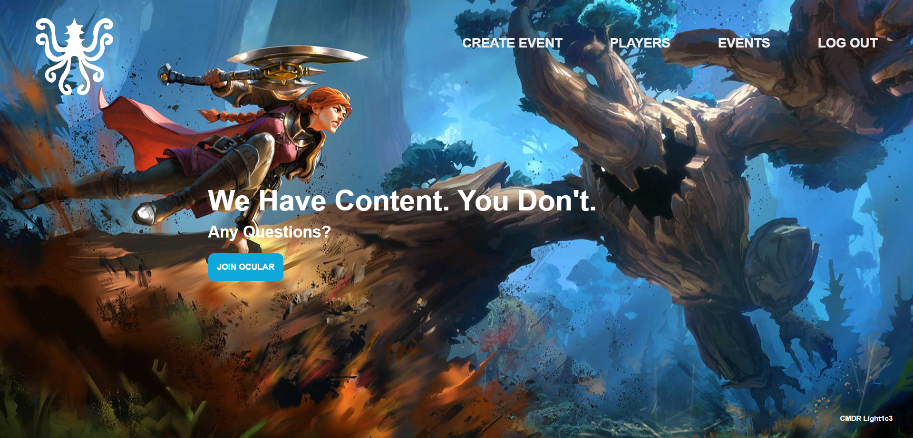
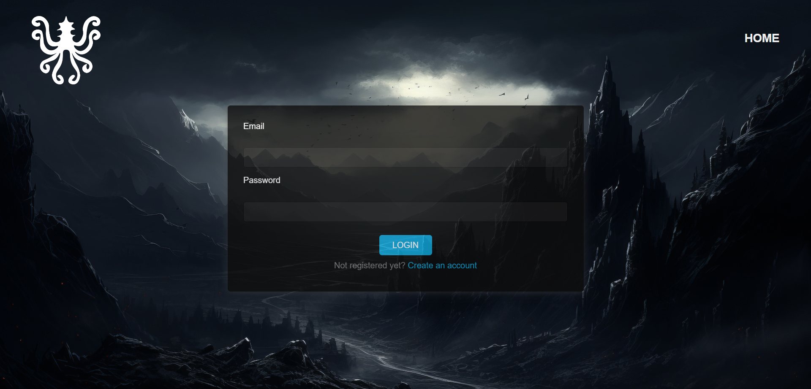
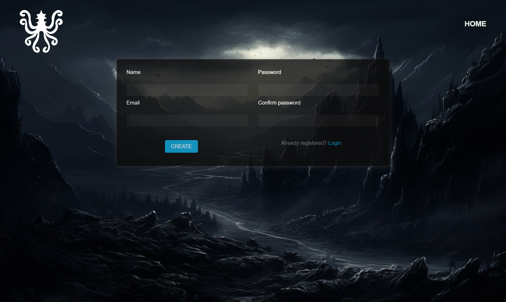
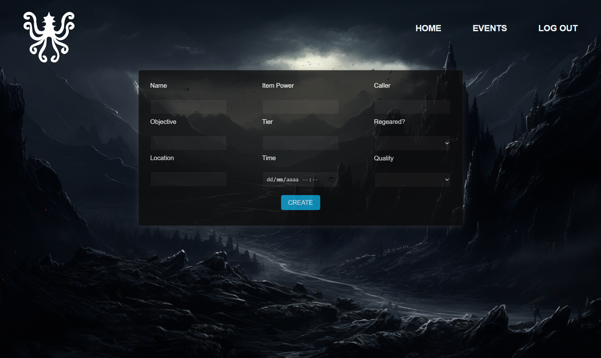
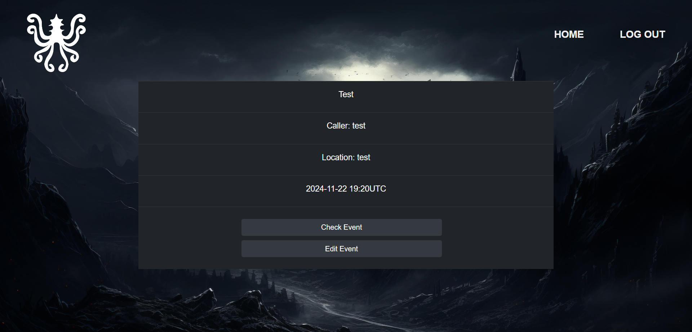
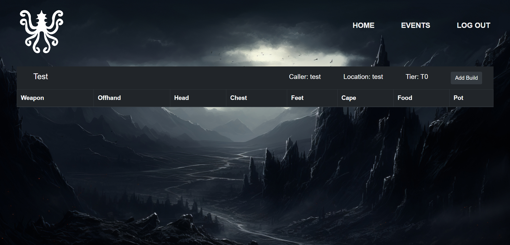
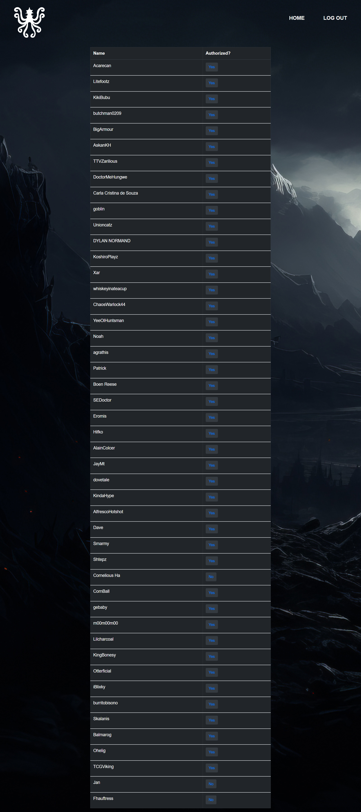
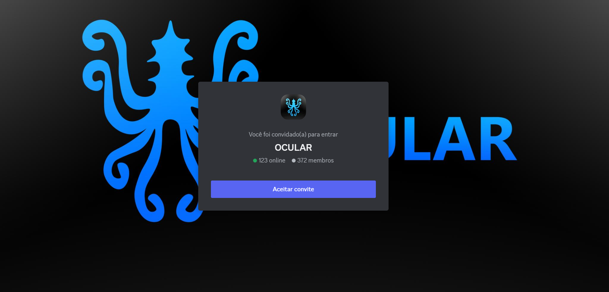

# 🎮 OCULAR GAMING - Sistema de Gerenciamento de Eventos

Sistema desenvolvido para otimizar a organização de eventos da **OCULAR GAMING**, uma das maiores guildas do jogo **Albion Online**. Criado com foco em agilidade, eficiência e integração entre os membros da guilda.

## 🌟 Principais Conquistas

- ⏱ **Redução do tempo** de organização e execução dos eventos em quase **10 vezes**.
  - Antes: eventos organizados via planilhas Excel podiam levar até **1 hora** para começar.
  - Agora: o processo leva **apenas alguns minutos** com o sistema automatizado.

## 🛠 Tecnologias Utilizadas

- **Front-end**: HTML, CSS, JavaScript
- **Back-end**: Elixir
- **Integração**: API REST
- **Banco de Dados**: PostgreSQL

## 🔐 Funcionalidades

- Tela de **login** e **cadastro** de usuários
- Formulário para **criação de eventos**
- Página com **listagem dos eventos**
- Modal para **criar builds**
- Tabela com **participantes confirmados**
- Encaminhamento direto para o canal da guilda no **Discord**
- Interface simples e funcional, pensada para facilitar o uso durante os eventos

## 🖼️ Capturas de Tela

> ⚠️ As imagens abaixo são representações das telas do sistema. O site está temporariamente fora do ar por conta da hospedagem.

### Página Inicial

### Login e Cadastro 

### Eventos 

### Tabela e Participantes

### Builds

### Integração com Discord

## 📈 Próximos Passos

A aplicação está em constante evolução com o objetivo de oferecer a melhor experiência para os usuários da guilda. Algumas melhorias em andamento ou previstas incluem:

- Refatoração e remoção de códigos desnecessários
- Padronização e melhorias visuais (UI/UX)
- Responsividade para diferentes dispositivos
- Reformulação e validação mais robusta dos formulários
- Correção e melhoria da hospedagem
- Planejamento de novos recursos e relatórios de desempenho

## 👥 Desenvolvedores

Desenvolvido por:

- **Carla Cristina de Souza**  
  🔗 [LinkedIn](https://www.linkedin.com/in/carlacrissouza/) | 📂 [GitHub](https://github.com/CarlaCristina-s)

- **Samuel Pizarro Pereira**  
  🔗 [LinkedIn](https://www.linkedin.com/in/samuelpp/) | 📂 [GitHub](https://github.com/Samuel-88)
